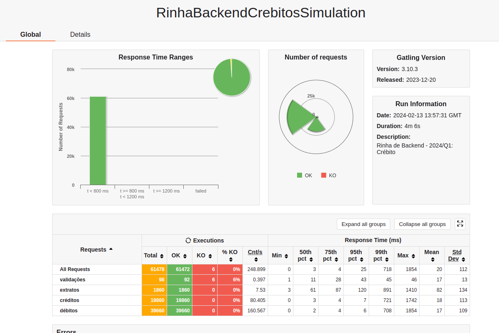

Projeto para a rinha de backend usando as seguintes tecnologias:

- Spring Webflux com o Spring Native
- Postgresql
- Nginx

O desafio era fazer uma api que passa no teste de carga da rinha com as limitações de memoria e cpu.

- cpu: 1.5 – uma unidade e meia de CPU distribuída entre todos os seus serviços
- memoria: 550MB – 550 mega bytes de memória distribuídos entre todos os seus serviços

